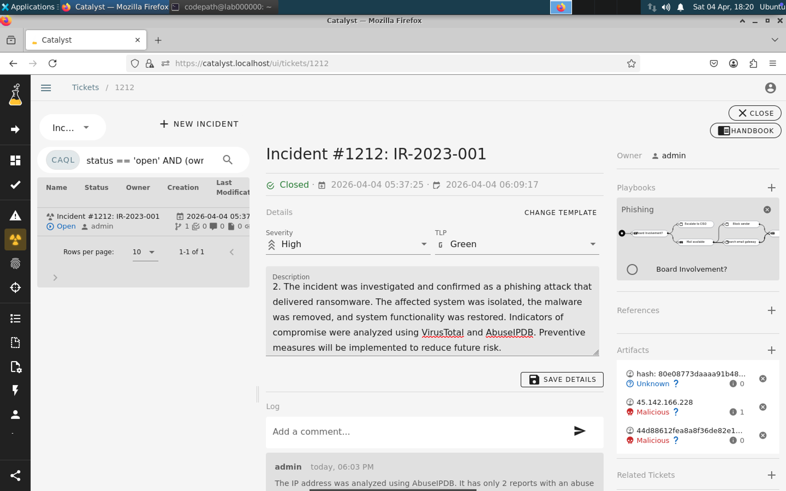
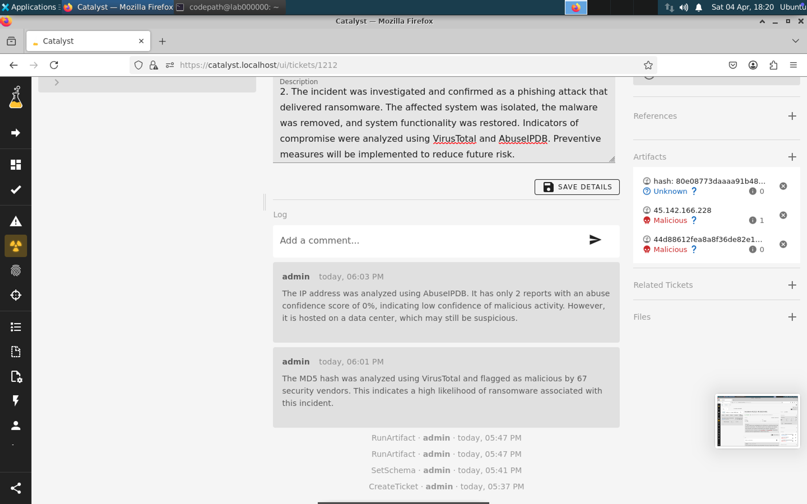
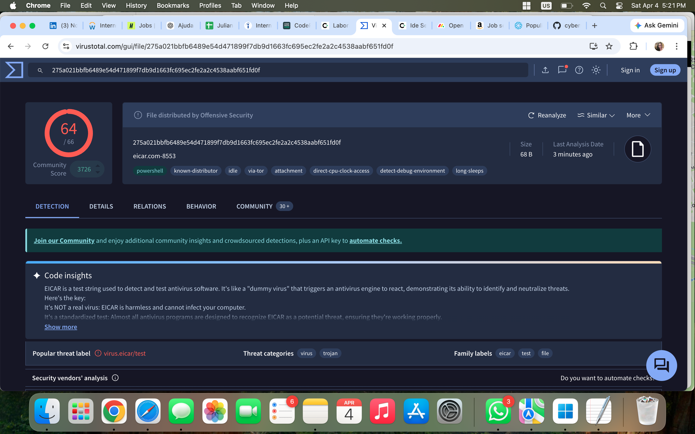

# Week 7 – Incident Response Lab

This lab focuses on incident response using Catalyst. The objective was to investigate a phishing incident, analyze indicators of compromise (IoCs), and document the response process.

## Topics Covered
- Incident creation and management
- Indicators of Compromise (IoCs)
- Malware analysis using VirusTotal
- IP analysis using AbuseIPDB
- Incident documentation and closure

## Deliverables
- Incident Report (Phishing)
- Lessons Learned Analysis

## Screenshots

### Incident Created

### VirusTotal Analysis

### AbuseIPDB Analysis

